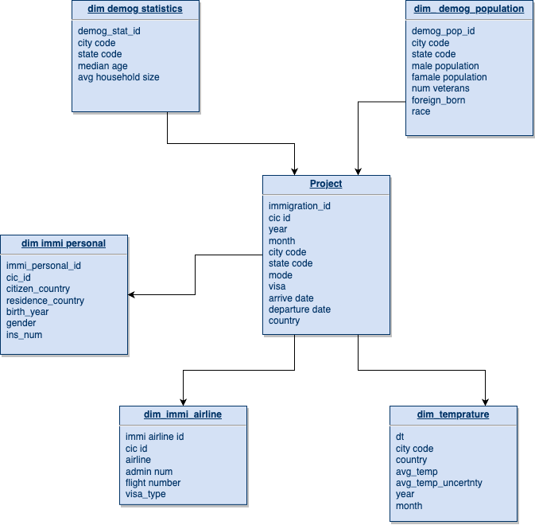

# Data Engineer Nanodegree Capstone Project

#### Project Summary
in this project we studying us immegrants data by designing OLAP data model able to build ETL pipeline with defined star schema.
Considering: 
- the Star Schema for the data model, which is optimized for OLAP queries.
- a large amount of data, the prospects for analysis and extracting insights from the data are endless.

We will touch on Exploratory Data Analysis on the collected data.


The project follows the follow steps:
* Step 1: Scope the Project and Gather Data
* Step 2: Explore and Assess the Data
* Step 3: Define the Data Model
* Step 4: Run ETL to Model the Data
* Step 5: Complete Project Write Up

From this tables we will be able to find insights in what songs their users are listening to.

### Step 1: Scope the Project and Gather Data

#### Scope 
The scope here is looking at the immigration data for the united states. More specifically, we're interested in looking at the following phenomena:

- the effects of temperature on the volume of travellers,
- the seasonality of travel
- the connection between the volume of travel and the demographics of various cities

#### Describe and Gather Data 
To accomplish this study, we will be using the following datasets:

- I94 Immigration Data: This data comes from the US National Tourism and Trade Office and includes the contents of the i94 form on entry to the united states. A data dictionary is included in the workspace.

- World Temperature Data: This dataset comes from Kaggle and includes the temperatures of various cities in the world fomr 1743 to 2013.

- U.S. City Demographic Data: This data comes from OpenSoft. It contains information about the demographics of all US cities and census-designated places with a population greater or equal to 65,000 and comes from the US Census Bureau's 2015 American Community Survey.

### Step 2: Explore and Assess the Data
#### Explore the Data 
- Use pandas and spark for exploratory data analysis to get an overview on these data sets
- Split data sets to dimensional tables and change column names for better understanding
- Utilize PySpark on one of the SAS data sets to test ETL data pipeline logic

#### Cleaning Steps

- Parse I94_SAS_Labels_Descriptions.SAS file to get auxiliary dimension table - country_code, city_code, state_code
- Tranform city, state in demography data to upper case to match city_code and state_code table
 

### Step 3: Define the Data Model
#### 3.1 Conceptual Data Model
Since the purpose of this data warehouse is for OLAP and BI app usage, we will model these data sets with star schema data modeling.

- Star Schema


#### 3.2 Mapping Out Data Pipelines
- Assume all data sets are stored in S3 buckets as below
    - ```[Source_S3_Bucket]/immigration/18-83510-I94-Data-2016/*.sas7bdat```
    - ```[Source_S3_Bucket]/I94_SAS_Labels_Descriptions.SAS```
    - ```[Source_S3_Bucket]/temperature/GlobalLandTemperaturesByCity.csv```
    - ```[Source_S3_Bucket]/demography/us-cities-demographics.csv```
- Follow by Step 2 – Cleaning step to clean up data sets
- Transform immigration data to 1 fact table and 2 dimension tables, fact table will be partitioned by state
- Parsing label description file to get auxiliary tables
- Transform temperature data to dimension table
- Split demography data to 2 dimension tables
- Store these tables back to target S3 bucket
 

### Step 4: Run Pipelines to Model the Data 
#### 4.1 Create the data model
Data processing and data model was created by Spark in previous parts of this notebook.

#### 4.2 Data Quality Checks
Data quality checks includes

- No empty table after running ETL data pipeline
- Data schema of every dimensional table matches data model

#### 4.3 Data dictionary 


#### 4.4 Example data usage
we can use the data models to get insights by tun SQL queries on modeled tables, below I got an example of how many immigrants arrived by country for Jan 2016

```
SELECT c.country, COUNT(*) FROM fact_immigration i
INNER JOIN country_code c ON i.country = c.country_id
WHERE i.year=2016 AND i.month=1
GROUP BY i.country
ORDER BY count DESC
LIMIT 10
```


### Step 5: Conclusion and Reflection

The target star Schema has been successfully created and passed the quality checks. The data model employed the tool and technologies: python, Pandas, and Apache Spark. The Schema is optimized to support OLAP queries. Even though the data model is created using a portion of the data, it is expected to work when we concatenate all of the data and load it with Spark. However, with a larger dataset or handling a large number of simultaneous queries, using more clusters or EMR would as the size of the data scales up.

#### Tools and Technologies usage:

Python, Pandas, and Spark enabled us to read, clean, ingest, process, load, and store the data with ease.

Spark was chosen over Hadoop for its better flexibility in wrangling data and better adaption in working on both local machines and scaling up nicely and efficiently on a larger cluster of nodes.

Pandas dataframes are extremely easy to explore and analyze. If we take a portion of the data in the spark session and put it into Pandas dataframe, we can implement a plethora of built-in functions that can help for serving as a proof of concept on a smaller scale, then test it on a larger scale with spark dataframes and user-defined functions.

We could use more technologies in future work. We might add Apache Airflow DAGs to automate fact table updates and data quality checks. Cloud-based storage and/or instance can be utilized to ensure that database is always up.

#### Data Model:

The star schema was designed with OLAP queries in mind. The ETL process, and sequentially the data quality checks, ensured that the dimension tables are normalized. This normalization allows for analytical queries they are more intuitive and less complex, and computationally inexpensive in case of aggregation on any of the dimensions. And due to the fact that the dimension tables are relatively small with a sufficiently large number of uniques primary keys, the joins are also intuitive and less taxing on the database.

#### Future Work and Optimizations
- **When the data was increased by 100x** in this case we are deploying more work nodes for Spark with data distributed between them. If this might not suffice as data scales up, we could use Amazon EMR, but it's more costly than the addition of more nodes in the cluster.

- **How do you run this pipeline on a daily basis by 7 am every day.** In this case, we can design Apache Airflow DAGs that execute the ETL pipeline as well as data quality checks, scheduled to run every day at 7 am, then check the logs for better understanding for what happened before.

- **How do you make your database could be accessed by 100+ people?** In this case, we might consider creating additional tables that are optimized for the most frequent queries.